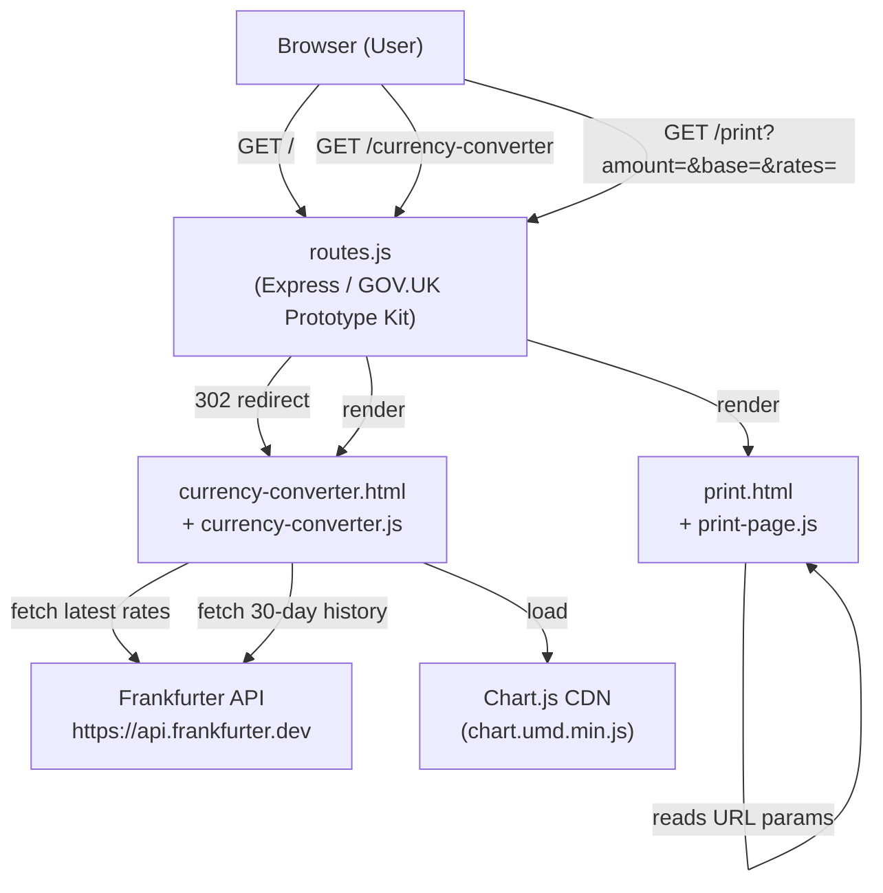
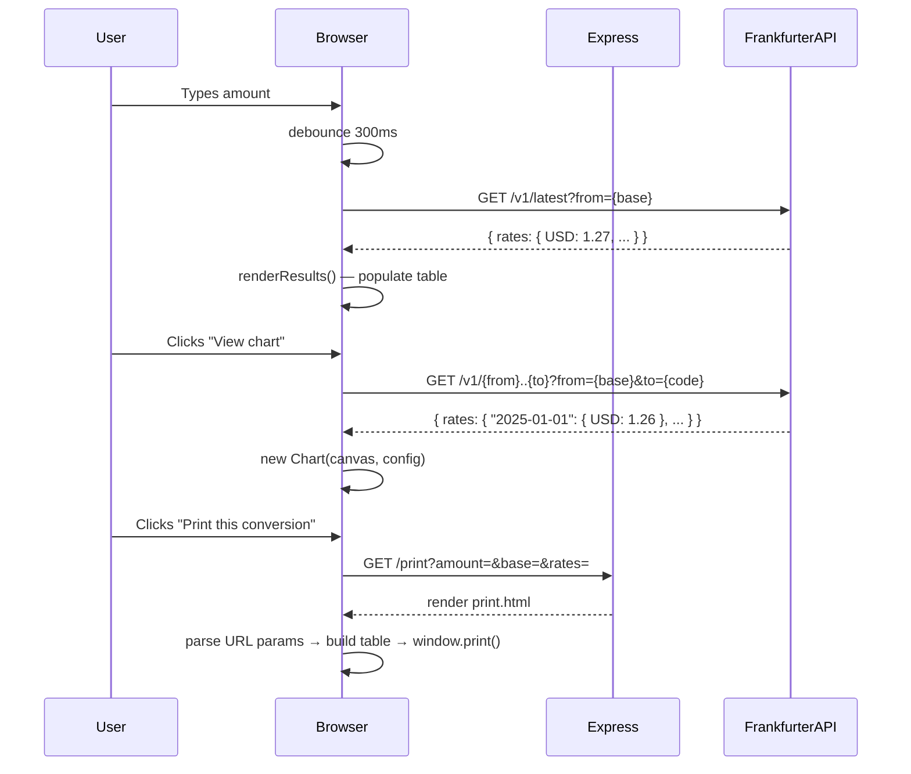

# Design Document

## Currency Converter

---

## Overview

The Currency Converter is a client-rendered GOV.UK Prototype Kit service. All exchange-rate logic runs in the browser; the Node.js server acts purely as a static page renderer with three simple Express routes. There is no server-side business logic, no database, and no session state.

The two key client-side JavaScript modules are:

- `currency-converter.js` — manages user input, debouncing, rate caching, results rendering, and the 30-day history chart.
- `print-page.js` — reads URL query parameters on the print page, builds the summary table, and triggers `window.print()`.

External data comes exclusively from the [Frankfurter API](https://www.frankfurter.dev), which proxies European Central Bank reference rates.

---

## Architecture



### Rendering Model

The GOV.UK Prototype Kit uses Nunjucks server-side templating. Both pages extend `layouts/main.html` which injects GOV.UK Frontend CSS and JS. Page-specific JavaScript is loaded via the `pageScripts` block at the bottom of each template, ensuring the DOM is ready before scripts execute.



---

## Components and Interfaces

### Server Layer (`routes.js`)

Three GET routes, no middleware or business logic:

| Route | Handler |
|---|---|
| `GET /` | `res.redirect('/currency-converter')` |
| `GET /currency-converter` | `res.render('currency-converter')` |
| `GET /print` | `res.render('print')` |

URL query parameters for the print page (`amount`, `base`, `rates`) are passed entirely client-side via the anchor `href` set by `updatePrintLink()`. Express never reads them.

### `currency-converter.js`

Self-contained IIFE. Internal state:

| Variable | Type | Purpose |
|---|---|---|
| `cachedRates` | `object \| null` | Latest rates keyed by target currency code |
| `cachedBase` | `string \| null` | The base currency of `cachedRates` |
| `debounceTimer` | `number \| null` | `setTimeout` handle for input debounce |
| `chartInstance` | `Chart \| null` | Active Chart.js instance |
| `lastAmount` | `number` | Most recently converted amount (for print link) |
| `lastResults` | `Array<{code, rate, converted}>` | Most recently rendered results |

Key functions:

| Function | Signature | Purpose |
|---|---|---|
| `formatAmount` | `(amount: number, currency: string) => string` | Formats using `Intl.NumberFormat` with `en-GB` locale; falls back to `toFixed(2) + ' ' + currency` |
| `getDateDaysAgo` | `(days: number) => string` | Returns ISO date string `days` before today |
| `updatePrintLink` | `() => void` | Sets `printLink.href` with serialised `amount`, `base`, and `rates` |
| `showChartForCurrency` | `(targetCode: string) => void` | Fetches history, renders Chart.js line chart |
| `renderResults` | `(amount: number, base: string, rates: object) => void` | Populates results table rows, updates print link |
| `fetchRatesAndRender` | `(amount: number, base: string) => void` | Checks cache; fetches if needed; calls `renderResults` |
| `onInput` | `() => void` | Validates input; clears or schedules `fetchRatesAndRender` |
| `onCurrencyChange` | `() => void` | Updates symbol prefix; clears cache and chart; calls `onInput` |

### `print-page.js`

Self-contained IIFE. Reads three URL query parameters at page load:

| Parameter | Type | Description |
|---|---|---|
| `amount` | `float` | Amount entered on converter page |
| `base` | `string` | Home currency ISO code |
| `rates` | `JSON string` | Object mapping currency codes to exchange rates |

Key functions:

| Function | Signature | Purpose |
|---|---|---|
| `formatAmount` | `(amount: number, currency: string) => string` | Same formatting logic as converter (duplicated) |
| `generateRef` | `() => string` | Returns `GCC-` + `Date.now().toString(36).toUpperCase()` |
| `formatDate` | `(d: Date) => string` | Full `en-GB` locale date/time string |

### CURRENCIES Constant

Defined independently in both modules (no shared module system). Represents the fixed set of 10 supported currencies:

```
GBP, USD, EUR, JPY, CAD, AUD, CHF, CNY, INR, MXN
```

Each entry carries `name` (converter) and `symbol` (converter), or just `name` (print page).

---

## Data Models

### Frankfurter API — Latest Rates Response

```
GET https://api.frankfurter.dev/v1/latest?from=GBP

{
  "amount": 1,
  "base": "GBP",
  "date": "2025-01-15",
  "rates": {
    "USD": 1.2734,
    "EUR": 1.1891,
    "JPY": 195.34,
    ...
  }
}
```

Only `rates` is stored in `cachedRates`.

### Frankfurter API — History Response

```
GET https://api.frankfurter.dev/v1/2024-12-16..2025-01-15?from=GBP&to=USD

{
  "amount": 1,
  "base": "GBP",
  "start_date": "2024-12-16",
  "end_date": "2025-01-15",
  "rates": {
    "2024-12-16": { "USD": 1.2601 },
    "2024-12-17": { "USD": 1.2644 },
    ...
  }
}
```

Keys of `data.rates` are sorted and used directly as Chart.js `labels`.

### Print Page URL Parameters

```
/print?amount=100&base=GBP&rates=%7B%22USD%22%3A1.27%2C...%7D
```

`rates` is `JSON.stringify`-ed on the converter page and `JSON.parse`-d on the print page, with a `try/catch` guard that defaults to `{}` on parse failure.

### In-Memory Rate Cache

```
cachedRates: { [currencyCode: string]: number }  // e.g. { USD: 1.2734, EUR: 1.1891, ... }
cachedBase:  string                               // e.g. "GBP"
```

Cache is invalidated (set to `null`) whenever `Home_Currency` changes.

---


## Correctness Properties

*A property is a characteristic or behavior that should hold true across all valid executions of a system — essentially, a formal statement about what the system should do. Properties serve as the bridge between human-readable specifications and machine-verifiable correctness guarantees.*

The pure functions in this codebase (`formatAmount`, `generateRef`, `formatDate`, `renderResults`, `updatePrintLink`) are well-suited to property-based testing. Infrastructure concerns (routing, DOM initialisation, Chart.js rendering) are better served by smoke or example-based tests and are excluded from the properties below.

Property-based tests should use **fast-check** (JavaScript PBT library). Each test should run a minimum of 100 iterations.

---

### Property Reflection

Before listing properties, redundancies among the candidates were reviewed:

- "Invalid inputs hide results" (1.4) subsumes the negative-number (8.1) and non-numeric (8.2) edge cases — those do not need separate properties.
- "Row omitted for zero/undefined rate" (8.4) is a specific instance of "table rows only for truthy rates" (3.1) — they are combined into a single row-count property.
- "Row contains ISO code, name, formatted amount" (3.2) and "row contains chart link" (3.4) are both about row content — combined into one comprehensive row-content property.
- `generateRef` format (5.2) and `formatDate` correctness (5.3) are independent and are kept separate.
- Print table row content (5.5) is analogous to results table row content (3.2) but on the print page — kept separate as they are distinct functions.

After reflection, six properties remain.

---

### Property 1: Invalid amounts hide the results view

*For any* value supplied to the amount input that is empty, negative, NaN, or non-finite, calling `onInput` should result in the results `<div>` having its `hidden` attribute set, with no error banner shown.

**Validates: Requirements 1.4, 8.1, 8.2**

---

### Property 2: Currency symbol prefix matches selected currency

*For any* currency code in the Supported_Currencies set, calling `onCurrencyChange` with that code selected should set the `currencySymbol` element's `textContent` to exactly `CURRENCIES[code].symbol`.

**Validates: Requirements 1.3**

---

### Property 3: Results table row count and content

*For any* valid positive amount, any home currency code, and any rates object (which may include zero or undefined values), `renderResults` should produce exactly one table row for each currency code in Supported_Currencies that (a) is not equal to the home currency and (b) has a truthy non-zero rate value in the rates object. Each row must contain the currency ISO code, its full name, and a non-empty formatted monetary string.

**Validates: Requirements 3.1, 3.2, 3.4, 8.4**

---

### Property 4: Amount formatting decimal precision

*For any* finite positive number, `formatAmount(amount, 'JPY')` must return a string whose numeric portion contains no decimal point (zero decimal places). For any finite positive number and any supported non-JPY currency code, `formatAmount(amount, code)` must return a string whose numeric portion ends with exactly two digits after a decimal separator.

**Validates: Requirements 3.3, 8.5**

---

### Property 5: Print link URL encodes all conversion state

*For any* valid positive amount, any home currency code, and any non-empty rates object, after `updatePrintLink` is called, `printLink.href` must be a URL containing query parameters `amount`, `base`, and `rates`, where `rates` round-trips correctly through `JSON.parse`.

**Validates: Requirements 5.1**

---

### Property 6: Reference number format invariant

*For any* invocation of `generateRef()`, the returned string must match the regular expression `/^GCC-[A-Z0-9]+$/` — a `GCC-` prefix followed by one or more uppercase alphanumeric characters.

**Validates: Requirements 5.2**

---

## Error Handling

| Scenario | Behaviour |
|---|---|
| `fetch` for latest rates fails (network error or non-200) | `showError()` called with standard message; results div hidden |
| `fetch` for chart history fails | `chartSection` hidden; no error banner shown to user |
| `JSON.parse` of `rates` URL param fails (print page) | Caught by `try/catch`; `rates` defaults to `{}`; placeholders shown |
| `Intl.NumberFormat` throws for a currency code | Caught by `try/catch` in `formatAmount`; falls back to `toFixed(2) + ' ' + currency` |
| Rate value is zero or `undefined` for a currency | `if (!rate) return` guard in `renderResults` skips that row silently |
| Amount is negative, empty, or non-numeric | `onInput` short-circuits before fetch; results and chart hidden |

Error states are mutually exclusive in the UI: the error banner and results table are never shown simultaneously.

---

## Testing Strategy

### Unit / Example Tests

These cover specific scenarios, state transitions, and integration points:

- Cache hit: entering a second amount with the same base does not fire a second `fetch` call.
- Cache miss: changing home currency clears `cachedRates` and triggers a new `fetch`.
- Debounce: advancing fake timers by < 300 ms does not fire `fetch`; advancing ≥ 300 ms does.
- Error banner shown on non-200 response; hidden on subsequent success.
- Chart lifecycle: instance destroyed on "Hide chart" click and on currency change.
- Chart fetch: URL constructed correctly with 30-day date range and correct `from`/`to` params.
- Print auto-print: `window.print` called after exactly 600 ms via fake timers.
- Input cleared immediately: hiding results does not wait for debounce timer.
- Print page with malformed `rates` param shows dashes without throwing.

### Property-Based Tests (fast-check)

Each of the six properties above maps to one fast-check test suite. Configuration:

- Minimum **100 iterations** per property (fast-check default is 100; keep as is).
- Tag each test with a comment: `// Feature: currency-converter, Property {N}: {title}`
- Generators needed:
  - `fc.float({ min: 0.01, max: 1_000_000 })` — valid positive amounts
  - `fc.constantFrom(...Object.keys(CURRENCIES))` — supported currency codes
  - `fc.dictionary(fc.constantFrom(...Object.keys(CURRENCIES)), fc.float({ min: 0 }))` — rates objects
  - `fc.oneof(fc.constant(''), fc.float({ max: -0.01 }), fc.constant(NaN))` — invalid amounts

### Integration / Smoke Tests

- Routes return expected HTTP status codes (`GET /` → 302, `GET /currency-converter` → 200, `GET /print` → 200).
- GOV.UK error summary has `role="alert"` attribute.
- All 10 currency options present in the select; GBP selected by default.
- Rate attribution note contains "European Central Bank".
- Print page disclaimer text present in DOM.
